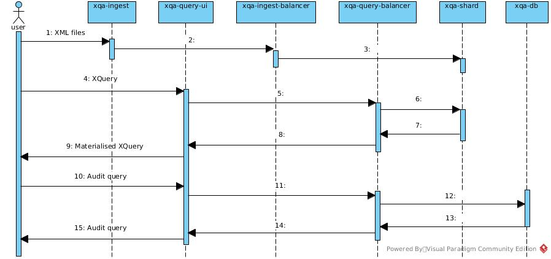
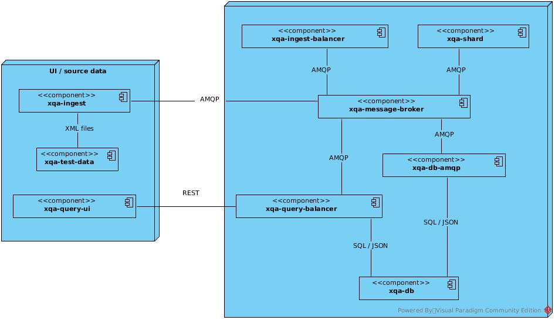

# XQA - XML Quality Assurance 
## 1. Introduction
* XQA is a suite of Docker based Microservices that improves the scalability of [BaseX](http://basex.org/) - an XML database engine.
* Instead of loading XML files into a single BaseX engine, XQA distributes them - via an AMQP message broker - across multiple BaseX engines.
* XQA lets you easily run XQuery against the distributed XML files.

## 2. High Level Design

## 3. Key Features
* Easy to deploy / extend:
    * each Microservice runs in a Docker container.
    * end to end integration tests for [TravisCI](https://github.com/jameshnsears/xqa-perf/blob/master/.travis.yml) and [CircleCI](https://github.com/jameshnsears/xqa-documentation/blob/master/.circleci/config.yml) included.
    * add extra BaseX engines easily, they self register themselves.
* Proven scalability & performance improvements - graphs in [xqa-perf](https://github.com/jameshnsears/xqa-perf) covering:
    * timing statistics.
    * shard item distribution.
* Transparency:
    * container console logging.
    * JSON instrumentation sent to a PostgreSQL instance.
* High test coverage.
* Completely open-source.

## 4. Interesting Technologies
* [ActiveMQ 5.15.7](http://activemq.apache.org/)
* [Angular](https://angular.io/)
* Docker CE & Docker Compose - containers can be build from GitHub source or downloaded from [hub.docker.com](https://hub.docker.com/)
* Java 11 - [Dropwizard](http://www.dropwizard.io/); Maven; [Qpid JMS](https://qpid.apache.org/components/jms/index.html)
* PostgreSQL 11
* Python 3.6 - [lxml](https://lxml.de/); [Matplotlib](https://matplotlib.org/); [pytest](https://docs.pytest.org/en/latest/); [Qpid Proton](https://qpid.apache.org/proton/)
* Ubuntu 18.04

## 5. Docker Microservices

| travis-ci.org | coveralls.io | GitHub repo. | Description |
| ------------- | ------------- | ------------- | ------------- |
|  |  | [xqa-commons-qpid-jms](https://github.com/jameshnsears/xqa-commons-qpid-jms) | a Maven Central shared library. |
|  | N/A | [xqa-db](https://github.com/jameshnsears/xqa-db) | PostgreSQL. |
|  |  | [xqa-db-amqp](https://github.com/jameshnsears/xqa-db-amqp) | AMQP interface to PostgresSQL. |
|  |  | [xqa-ingest](https://github.com/jameshnsears/xqa-ingest) | XML file loader. |
|  |  | [xqa-ingest-balancer](https://github.com/jameshnsears/xqa-ingest-balancer) | distributes XML across XQA BaseX engine(s). |
|  | N/A | [xqa-message-broker](https://github.com/jameshnsears/xqa-message-broker) | ActiveMQ. |
|  |  | [xqa-shard](https://github.com/jameshnsears/xqa-shard) | BaseX engine with AMQP interface. |
|  |  | [xqa-query-balancer](https://github.com/jameshnsears/xqa-query-balancer) | REST API interface. |
|  |  | [xqa-query-ui](https://github.com/jameshnsears/xqa-query-ui) | UI for querying XQA. |
|  | N/A | [xqa-perf](https://github.com/jameshnsears/xqa-perf) | end to end integration tests, with Matplotlib graphs. |
| N/A | N/A | [xqa-test-data](https://github.com/jameshnsears/xqa-test-data) | a collection of XML files used by XQA. |

## 5. Limitatons
Currently, XQA is a proof of concept project. It achieves what it set out to prove, but should not be considered ready for production. Reasons for this include:
* BaseX instances are configured to store data in RAM.
* there is minimal security between microservices. 

## 6. Current Status
* Refer to the GitHub [issue board](https://github.com/jameshnsears/xqa-documentation/projects/1).
