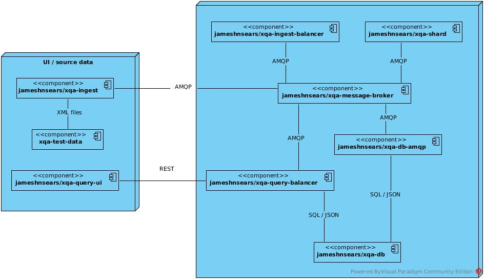

# XQA - XML Quality Assurance 
## 1. Introduction
* XQA is a suite of container based microservices that improves the scalability of [BaseX](http://basex.org/) - an XML database engine.
* Instead of loading XML into a single BaseX instance, XQA distributes XML / XQuery - via an AMQP message broker - across multiple BaseX instances.

## 2. Key Features
* easy to deploy & validate scalability improvements via end to end integration tests for [Travis](https://github.com/jameshnsears/xqa-perf/blob/master/.travis.yml) and [Circle CI](https://github.com/jameshnsears/xqa-documentation/blob/master/.circleci/config.yml).
* transparency
    * plenty of container console logging.
    * JSON instrumentation sent to a PostgreSQL instance.
* high unit test code coverage.
* simple UI.
* completely open-source.

## 3. Core Technologies
* AMQP / [ActiveMQ](http://activemq.apache.org/)
* [Angular](https://angular.io/)
* Docker CE & Docker Compose
* Java
    * Maven importable projects.
    * [Dropwizard](http://www.dropwizard.io/)
    * [Qpid JMS](https://qpid.apache.org/components/jms/index.html)
* PostgreSQL
* Python
    * [Qpid Proton](https://qpid.apache.org/proton/)
* Ubuntu 18.04

## 3. Topography
Each microservice:
* lives in a separate GitHub repo.
* contains build instructions in a README file.
* has a .travis.yml file - demonstrating usage / deployment / coverage.

## 4. The XQA Suite
*   [xqa-commons-qpid-jms](https://github.com/jameshnsears/xqa-commons-qpid-jms) - maven central hosted common qpid-jms code.

*  [xqa-db](https://github.com/jameshnsears/xqa-db) - PostgreSQL.

*   [xqa-db-amqp](https://github.com/jameshnsears/xqa-db-amqp) - AMQP PostgresSQL interface.

*   [xqa-ingest](https://github.com/jameshnsears/xqa-ingest) - loads XML files into XQA.

*   [xqa-ingest-balancer](https://github.com/jameshnsears/xqa-ingest-balancer) - "evenly" distributes XML / XQuery across XQA.

*  [xqa-message-broker](https://github.com/jameshnsears/xqa-message-broker) - AMQP message broker - ActiveMQ.

*   [xqa-shard](https://github.com/jameshnsears/xqa-shard) - BaseX instance with a AMQP interface.

*   [xqa-query-balancer](https://github.com/jameshnsears/xqa-query-balancer) - REST API to execute SQL/JSON queries.

*   [xqa-query-ui](https://github.com/jameshnsears/xqa-query-ui) - UI for querying XQA.

*  [xqa-perf](https://github.com/jameshnsears/xqa-perf) - end to end integration tests.

* [xqa-test-data](https://github.com/jameshnsears/xqa-test-data) - test data - XML files - used by tests.

## 5. Limitations
* BaseX instances store data in RAM.

## 6. Current Status
* For current status refer to the [issue board](https://github.com/jameshnsears/xqa-documentation/projects/1) in GitHub.
