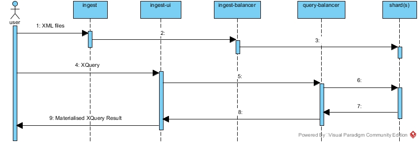

# XQA - XML Quality Assurance 

## 1. Introduction
XQA is a **proof of concept** project that combines various open-source technologies to provide a lightweight, highly scalable XML database.

## 2. High Level Design
At the heart of the design is a message broker. Container based microservices leverage the broker to ingest and evenly distribute XML across in-memory database shards.

## 3. Technologies
* [Apache ActiveMQ](http://activemq.apache.org/) - AMQP 1.0; HTTP.
    * [Apache Qpid Proton](https://qpid.apache.org/proton/) - Qpid JMS; Qpid Proton Python.
* [BaseX.](http://basex.org/)
* [Docker CE](https://docs.docker.com/engine/) & [Docker Compose](https://docs.docker.com/compose/).
* Java 8.
    * [Maven](https://maven.apache.org/).
* Linux - [Debian Stretch](https://www.debian.org/releases/); [CentOS 7](https://wiki.centos.org/Download).
* Python 3.5+.
* [Visual Paradigm Community Edition](https://www.visual-paradigm.com/download/community.jsp) - UML diagrams.

## 4. Microservices
XQA is composed of distinct microservices, each:
* lives in a separate GitHub repo.
* contains build instructions in a README file.
* has a .travis.yml file demonstrating usage.
* except for [xqa-ingest](https://github.com/jameshnsears/xqa-ingest), each service is packaged in containers available from  [hub.docker.com](https://hub.docker.com/search/?isAutomated=0&isOfficial=0&page=1&pullCount=0&q=jameshnsears&starCount=0).

### 4.1. Core Services
*   [xqa-ingest](https://github.com/jameshnsears/xqa-ingest) - loads the contents of XML files, from the file system, into an AMQP queue.

*   [xqa-ingest-balancer](https://github.com/jameshnsears/xqa-ingest-balancer) - evenly distributes the ingested XML across one or more shards.

*   [xqa-shard](https://github.com/jameshnsears/xqa-shard) - an embedded in-memory BaseX instance with a AMQP interface.

*   [xqa-query-ui](https://github.com/jameshnsears/xqa-query-ui) - a simple web UI to run XQuery and to also observe health of an XQA deployment.

*   [xqa-query-balancer](https://github.com/jameshnsears/xqa-query-balancer) - executes XQuery against each shard and materialises the results.

*  [xqa-message-broker](https://github.com/jameshnsears/xqa-message-broker) - an ActiveMQ instance that provides AMQP and HTTP.

### 4.2. Optional Services
*  [xqa-elk](https://github.com/jameshnsears/xqa-elk) - Logstash (with Filebeat grok for ActiveMQ audit log); Elasticsearch; Kibana.
    * the Filebeat is available in [xqa-message-broker](https://github.com/jameshnsears/xqa-message-broker.
* [xqa-test-data](https://github.com/jameshnsears/xqa-test-data) - sample XML files.

## 5. UI
* cadvisor - [http://0.0.0.0:8080](http://0.0.0.0:8080)
* xqa-elk-kibana - [http://0.0.0.0:5601/](http://0.0.0.0:5601/) - kibana/changeme
* xqa-elk-elasticsearch - [http://0.0.0.0:9200/](http://0.0.0.0:9200/) - elastic/changme
* xqa-elk-logstash - [http://0.0.0.0:9200/](http://0.0.0.0:9200/) - logstash_system/changeme
* xqa-message-broker - [http://0.0.0.0:8161/admin/](http://0.0.0.0:8161/admin/) - admin/admin

## 6. Contribute
Instructions for [building](building.md) the software.

## 7. Deploy
Instructions for [deploying](deploying.md) the software.

## 8. Performance
Visit the [performance](performance.md) page to see how the XQA implementation compares to a native, standalone, BaseX implementation.

## 9. Limitations
Remember: XQA is **proof of concept** that means it's not production ready...
* XQA is built with BaseX and Qpid Pronton / JMS, whatever limitations they have, then so does XQA.
* Services need to be started in sequential order:
    1. xqa-message-broker
    2. xqa-shard
    3. xqa-ingest-balancer
    4. xqa-ingest
* Security is not implemented - i.e. default username and passwords are used for UI components & SSL / SASL is not used.
* Transactions are not implemented.
* Shard memory is measured, but not managed - i.e. you can run out of RAM.

