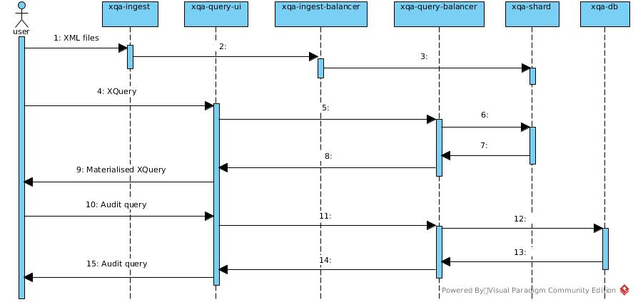
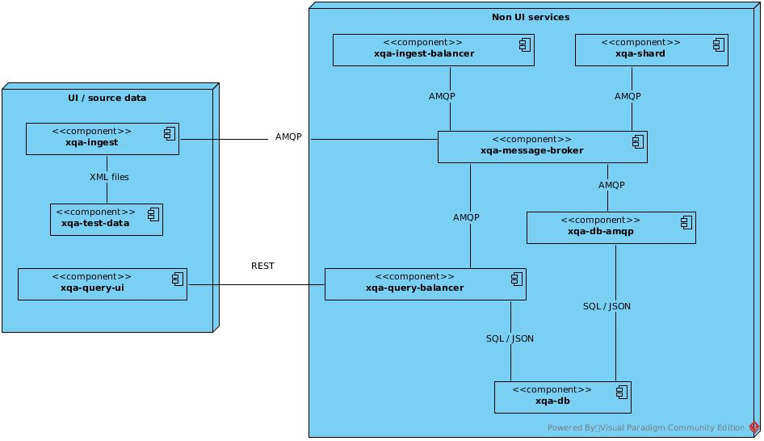

# XQA - XML Quality Assurance 
## 1. Introduction
* XQA is a suite of Docker based microservices that improves the scalability of [BaseX](http://basex.org/) - an XML database engine.
* Instead of loading each XML file into a single BaseX engine, XQA distributes them - via an AMQP message broker - across multiple BaseX engines.
* XQA ships with a basic web frontend - as well as a REST API - which lets you run XQuery, and analytics, against the distributed data.

## 2. High Level Design

## 3. Key Features
* Easy to deploy / extend:
    * each microservice runs in its own container.
    * add extra BaseX engines easily - they self register against the AMQP message broker.
    * can run in either a docker-compose or [k8s](K8S.md) environment.
* Proven scalability & performance improvements - graphs in [xqa-perf](https://github.com/jameshnsears/xqa-perf) show:
    * ingest timing statistics.
    * XML file distribution.
* [Quality Radiatior](QUALITY-RADIATOR.md) for CI; static analysis and coverage metrics.
* Transparency:
    * container console logging.
    * JSON instrumentation sent to a central PstgreSQL instance.

## 4. Open Source Technologies
* ActiveMQ
* Angular
* Docker - containers can be built from GitHub or pull'd from [hub.docker.com](https://hub.docker.com/).
* Java 10/11.
* PostgreSQL 11
* Python 3.6
* Ubuntu 18.04

## 5. Microservices

| CI | GitHub | |
| ------------- | ------------- | ------------- |
|  | [xqa-commons-qpid-jms](https://github.com/jameshnsears/xqa-commons-qpid-jms) | a Maven Central shared library. |
|  | [xqa-db](https://github.com/jameshnsears/xqa-db) | PostgreSQL. |
|  | [xqa-db-amqp](https://github.com/jameshnsears/xqa-db-amqp) | AMQP interface to PostgresSQL. |
|  | [xqa-ingest](https://github.com/jameshnsears/xqa-ingest) | XML file loader. |
|  | [xqa-ingest-balancer](https://github.com/jameshnsears/xqa-ingest-balancer) | distributes XML across XQA BaseX engine(s). |
|  | [xqa-message-broker](https://github.com/jameshnsears/xqa-message-broker) | ActiveMQ. |
|  | [xqa-perf](https://github.com/jameshnsears/xqa-perf) | end to end integration tests, with Matplotlib graphs. |
|  | [xqa-query-balancer](https://github.com/jameshnsears/xqa-query-balancer) | XQA REST API. |
|  | [xqa-query-ui](https://github.com/jameshnsears/xqa-query-ui) | UI for querying XQA. |
|  | [xqa-shard](https://github.com/jameshnsears/xqa-shard) | BaseX engine with AMQP interface. |
| | [xqa-test-data](https://github.com/jameshnsears/xqa-test-data) | a collection of XML files used by XQA. |

## 6. Limitatons
XQA is a proof of concept project. It [scratched an itch](https://en.wikipedia.org/wiki/The_Cathedral_and_the_Bazaar) and achieved what it set out to prove. Refer to the GitHub [issue board](https://github.com/jameshnsears/xqa-documentation/projects/1) for outstanding issues.
