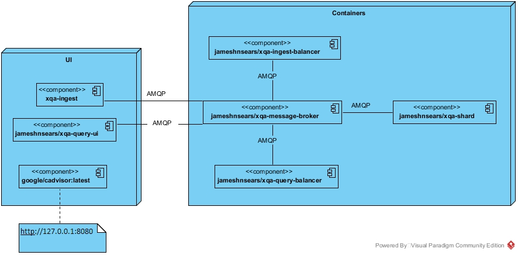
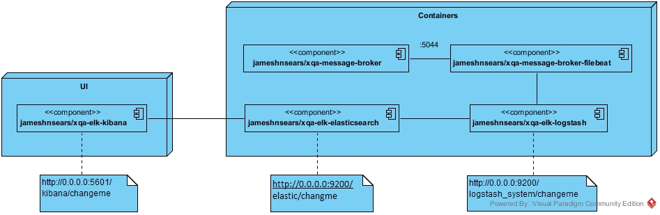

# Deploying
 see [.travis.yml](.travis.yml) for an example of a single shard, single host, end to end environment. 

XQA can be installed with or without ELK - for the xqa-message-broker logging.

## 1. Simple Deployment - Without ELK

## 2. With ELK

## 3. Installing Multiple Shards
??? - Docker Swarm; K8S
