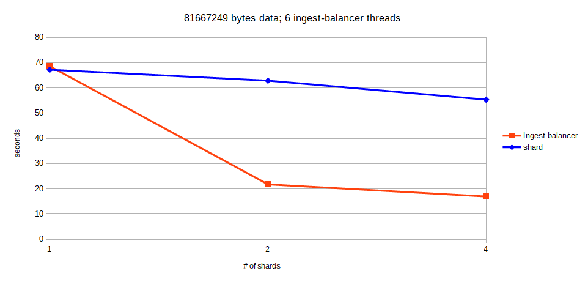
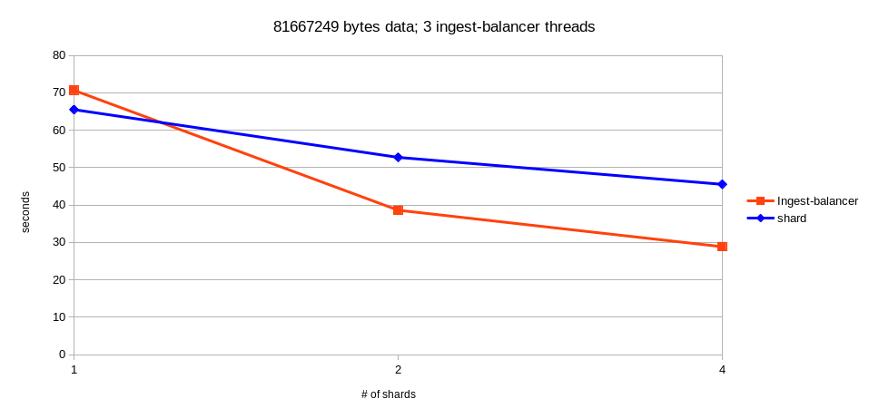

# Performance
This section documents the scalability of XQA.

The test involves running [test/perf_test.sh](test/perf_test.sh) with an appropriate SHARDINSTANCES value.

Each test run includes:
* a tear down of the containers - creating a clean environemnt.
* a test, based on sha256 + correllaton_id values, to ensure all data (UTF-8) has passed end to end (ingest to shard) successfully.

Data points are take from uniform positions in the resulting log files and timings produced from [test/results/stats.py](test/results/stats.py)

## 1. Environment
* CentOS 7 VM, running on a SSD with 8GB of RAM.
* using xqa-test-data.
* Host + Guest OS's in an idle state.

## 2. Results
Tagged @ 201801011133.

### 2.1. Test A

### 2.2. Test B

